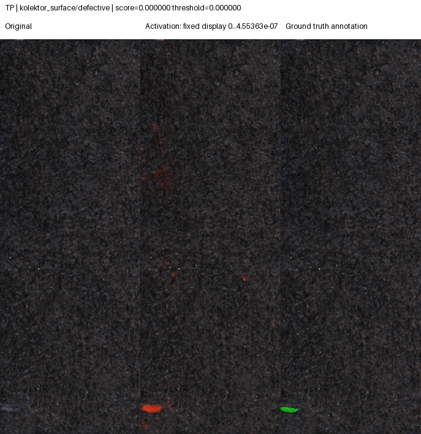
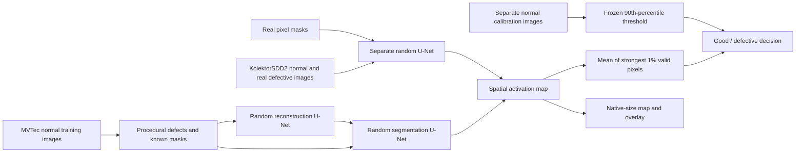

# Industrial Inspection

**Industrial defect detection from random initialization — with controlled experiments, calibrated decisions, and visible failure cases.**

[Live inspection demo](https://numan-industrial-inspection.streamlit.app/) · [Controlled study](docs/results/CONTROLLED_STUDY.md) · [Model card](docs/MODEL_CARD.md) · [Training protocol](docs/EXPERIMENTS.md) · [Data provenance](docs/DATA.md)

[](https://github.com/numann44/industrial-inspection/actions/workflows/checks.yml)

This project connects audited industrial images, reproducible training, separate threshold calibration, original-resolution evaluation and an interactive CPU inspection app. The completed study contains **17 training runs**: 14 normal-only MVTec experiments and three supervised KolektorSDD2 experiments. Every project model starts from random weights; the pretrained PatchCore reference is documented separately.

> **Measured outcome:** the selected KolektorSDD2 surface model detects **105/110 defects (95.45%)**, with **89/894 normal false alarms (9.955%)** and **0.8155 native pixel AP**. This meets the declared dataset point-estimate target. **All three selected MVTec category models fail the target.** KolektorSDD2 uses real defect labels in a separate task; it does not demonstrate success on nuts, screws or transistors. Confidence intervals and robustness tests limit the passing result.

## Results at frozen thresholds

Configuration, checkpoint and deployment seed are selected using validation evidence before test evaluation. The threshold is the 90th percentile of separate normal calibration scores; it is never adjusted to make a test result pass. The target requires both ≥90% defect recall and ≤10% normal false alarms.

| Task / selected seed | Training supervision | Defects detected | Normal false alarms | Image AUROC | Native pixel AP | Dataset target |
| --- | --- | ---: | ---: | ---: | ---: | --- |
| KolektorSDD2 surface / 44 | Real images and defect masks | **105/110 (95.45%)** | **89/894 (9.955%)** | **0.9754** | **0.8155** | Met as point estimates |
| Metal nut / 44 | Normal images + synthetic defects | 36/93 (38.7%) | 3/22 (13.6%) | 0.7278 | 0.1672 | Not met |
| Screw / 42 | Normal images + synthetic defects | 50/119 (42.0%) | 2/41 (4.9%) | 0.8660 | 0.1470 | Not met |
| Transistor / 42 | Normal images + synthetic defects | 8/40 (20.0%) | 6/60 (10.0%) | 0.4408 | 0.0817 | Not met |

Metal-nut results are **development-inspected / exploratory**. Screw, transistor and KolektorSDD2 retain the completed study's frozen held-out evaluation status. Each category has its own weights. Training separate models is not evidence that one model generalizes across these parts.

For the selected surface model, the 95% Wilson intervals are **89.8–98.0% recall** and **8.16–12.09% false alarms**. They cross the target boundaries, so the test does not establish those population-level guarantees. At the test set's approximately 11% defect prevalence, only **54.1% of alerts are true defects**. The official split also lacks product/batch identifiers, so image-level separation does not establish batch independence.

All five missed surface defects occupy less than 1% of their original image. The model's false-alarm rate rises to **15.5% under +20% brightness** and **31.4% under JPEG quality 60**, without threshold changes. New imaging conditions require independent evaluation. See the [full study](docs/results/CONTROLLED_STUDY.md) for all seeds, ablations, native defect-size groups, uncertainty and perturbations.



Real test evidence, not a generated mockup. The three panels separate the original image, fixed-scale model activation and ground truth. Scores this small require scientific notation; the exact values are retained in the [gallery index](docs/results/controlled-study-galleries/kolektor_surface/index.json). [Dataset attribution and derivative-image license](docs/results/controlled-study-galleries/kolektor_surface/ATTRIBUTION.md).

## What the project demonstrates

- **Audited data:** complete MVTec AD and KolektorSDD2 downloads, content hashes, image/mask checks, duplicate handling and frozen partitions.
- **Controlled learning:** foreground restriction, scratch synthesis, resolution and reconstruction-assistance comparisons; separate real-defect supervision after the declared fallback trigger.
- **Recoverable training:** atomic best/last checkpoints, optimizer and random-state recovery, saved code/environment provenance and protection against accidental run replacement.
- **Honest selection:** one shared synthetic validation bank for MVTec candidates; real validation masks for KolektorSDD2; test-winning seeds never replace the frozen selection.
- **Measured failures:** false-positive/false-negative galleries, native-mask pixel AP, image-level uncertainty, defect-size analysis and perturbation tests.
- **One inference contract:** the CLI, evaluator and Streamlit app load the same preprocessing, category, scoring, threshold and checkpoint identity, retaining float32 maps.

## Two learning pipelines



The MVTec joint model has **977,876 parameters** at 16 base channels and 256×256 input. It is a compact DRAEM-inspired experiment, not a reproduction or a claimed new research algorithm. The best eligible configuration by synthetic validation was the joint 256-pixel model, but strong synthetic validation did not transfer to real defects. The selected metal-nut model detects only **2 of 23 scratches**.

The [supervised surface model](docs/SUPERVISED_PROTOCOL.md) has **488,705 parameters**. It preserves aspect ratio inside a **640-pixel-high × 256-pixel-wide** letterbox; padding is excluded from the loss, score and restored map. Training combines positive-weighted BCE and Dice, with balanced sampling of normal and defective examples. Three seeds use the same audited split, a 100-epoch limit and 15-epoch early-stopping patience. Seed 44's epoch-60 weights were selected by validation; later test outcomes did not select them.

On the local Apple M4, the surface model's warm forward-and-score median is **98.94 ms on CPU** and **13.74 ms on MPS**. These measurements exclude model loading, decoding, preprocessing, transfers, rendering and hosting overhead; they are not end-to-end cloud response times.

## Run locally

Python 3.12 is the tested runtime. CPU works for inspection; local training uses Apple M4/MPS. CUDA is supported by the training device selector but has not been benchmarked here.

```bash
python3.12 -m venv .venv
source .venv/bin/activate
python -m pip install -r requirements.txt
python -m pip install -e '.[dev,demo]'
python scripts/fetch_demo_models.py
python -m pytest
streamlit run app.py
```

`artifacts/models.json` is authoritative for the active demo selection and checksum-pinned download URLs. The full datasets are not required to serve the demo. `requirements.lock.txt` records the local experiment environment; deployment requirements use CPU PyTorch wheels on Linux. [Deployment evidence](docs/DEPLOYMENT.md) identifies which hosted model and behaviors were actually verified; completing the offline study alone does not verify a new hosted deployment.

### Reproduce normal-only training

```bash
python scripts/prepare_dataset.py
python -m inspection.data --root data/mvtec_ad --categories metal_nut \
  --output data/manifest.json --report data/audit.json \
  --archive-sha256 cf4313b13603bec67abb49ca959488f7eedce2a9f7795ec54446c649ac98cd3d
python -m inspection.validation_bank --manifest data/manifest.json \
  --output data/validation-bank-v2
python -m inspection.train --manifest data/manifest.json \
  --config configs/protocol_v2/metal_nut_joint_256.json \
  --bank data/validation-bank-v2/bank.json --output runs/my-joint-256
```

Resume with the same command plus `--resume runs/my-joint-256/last.pt`. Configuration, audited split, validation bank, source and runtime must match. Nonempty run directories cannot be silently replaced. MVTec protocol v2 ranks checkpoints by the harmonic mean of synthetic image AUROC and pixel AP, checked every five epochs and at the final epoch.

### Reproduce real-defect supervised training

```bash
python scripts/prepare_ksdd2.py
python -m inspection.ksdd2 --root data/ksdd2
python -m inspection.supervised --output runs/my-ksdd2-seed44 --training-seed 44
```

See the [fixed supervised protocol](docs/SUPERVISED_PROTOCOL.md) for split counts, loss, balanced sampling, calibration and recovery. Keep the official test unopened until all candidate weights and thresholds are fixed. The declared study can be reproduced with `scripts/run_study.py`; reporting and packaging verify its completed evidence before creating public artifacts.

### Inspect an image

```bash
python -m inspection.predict --checkpoint runs/my-ksdd2-seed44/checkpoint.pt \
  --image /path/to/surface.png --output outputs/my-inspection --device cpu
```

Exports include JSON, an original-size overlay, a display heatmap and a compressed **float32** map. The color scale is fixed per checkpoint. The score is not a defect probability, and highlighted pixels are not certified boundaries. Users select the matching task; the app does not automatically recognize arbitrary parts. Uploaded images are processed in memory by the application.

## Earlier experiments and pretrained reference

The [legacy experiment report](docs/results/EXPERIMENT_REPORT.md) preserves three earlier metal-nut runs, their original 95th-percentile thresholds, curves and failures. Its foreground pilot detected 51/93 defects with 1/22 false alarms. Those results are exploratory and are not overwritten by protocol v2.

The [PatchCore comparison](docs/results/PATCHCORE_REFERENCE.md) uses ImageNet WideResNet50-2 features, a 1% coreset and the official feature aggregation/scoring implementation. It detects 93/93 metal-nut defects but falsely flags 4/22 normal images (**18.2%**), failing the false-alarm target at its frozen threshold. Our audited split, square resize and exact PyTorch squared-L2 search differ from the published benchmark. The pretrained reference neither selects nor supplies weights to the from-scratch models.

```bash
python -m pip install -e '.[benchmark]'
python -m inspection.patchcore_baseline --manifest data/manifest.json \
  --output runs/my-patchcore
```

## Repository guide

| Location | Purpose |
| --- | --- |
| `src/inspection` | Data audits, models, training, checkpointing, inference and evaluation |
| `configs` | Reproducible legacy, controlled and supervised settings |
| `scripts` | Dataset preparation, serialized study, evidence verification and packaging |
| `tests` | Data isolation, resume, scoring, geometry and artifact integrity checks |
| `docs/results` | Measured reports, portable evidence and attributed failure galleries |
| `docs/model-cards` | Exact selected-model summaries, hashes, calibration and provenance |
| `app.py`, `artifacts`, `assets` | CPU demo, model registry and attributed examples |
| `data`, `runs`, `outputs` | Local datasets, weights and generated artifacts; excluded from Git |

The [delivery checklist](docs/PLAN.md) separates measured quality from engineering and publication. Any new method informed by these test results must label their reuse exploratory; a new independent success claim needs an untouched holdout. The completed study is retained even when subsequent experiments improve the method.

## Sources and licenses

- [MVTec AD](https://www.mvtec.com/research-teaching/datasets/mvtec-ad): images, annotations and derivatives are CC BY-NC-SA 4.0.
- [KolektorSDD2](https://www.vicos.si/resources/kolektorsdd2/): images, annotations and derivatives are CC BY-NC-SA 4.0.
- [DRAEM](https://arxiv.org/abs/2108.07610): inspiration for reconstruction-assisted anomaly segmentation.
- [PatchCore](https://github.com/amazon-science/patchcore-inspection): reference implementation, Apache-2.0; retained license and notices in `src/patchcore`.

Original project source is [MIT licensed](LICENSE). Dataset-derived examples retain dataset attribution, noncommercial and share-alike terms. Third-party code keeps its own license. The results are a research demonstration, not production acceptance certification.
