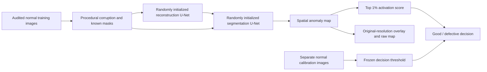

# Industrial Inspection

**Learning to detect defective parts — with reproducible experiments, visible failure cases, and models trained from random initialization.**

[Experiment evidence](docs/results/EXPERIMENT_REPORT.md) · [Training protocol](docs/EXPERIMENTS.md) · [Data provenance](docs/DATA.md) · [Model card](docs/MODEL_CARD.md)

This project connects the full inspection workflow: audited industrial images, controlled training, independent threshold calibration, native-resolution evaluation, and an interactive image inspection app. It starts with metal nuts, then tests the same procedure on screws and transistors using separate category models. A separately documented supervised surface-defect track uses KolektorSDD2.

> **Current status:** three exploratory metal-nut models are trained and measured. The controlled experiment study is running. The latest exploratory model detects **51 of 93 defective images**, with **1 false alarm among 22 normal images**. It does **not** meet the project target of ≥90% defect recall and ≤10% normal false alarms. The demo exposes these limitations and includes failure examples.

## What has been built

- **Audited data:** complete MVTec AD and KolektorSDD2 downloads, content hashes, image/mask checks, explicit duplicate handling and immutable data partitions.
- **From-scratch learning:** compact reconstruction and segmentation networks with controlled procedural defects; a separate real-defect supervised segmentation pipeline.
- **Resumable experiments:** atomic epoch checkpoints, optimizer and random-state recovery, strict compatibility checks, saved code/environment provenance.
- **Comparable model selection:** one frozen synthetic validation bank shared across candidates, with real test images excluded from training and selection.
- **Measured inspection:** calibrated image decisions, native-mask pixel AP, confidence intervals, defect-size analysis, and separate false-positive/false-negative galleries.
- **Shared inference:** the CLI, evaluator and Streamlit app load the same model contract and preserve float32 maps, preprocessing and checkpoint identity.

## Measured exploratory results

These runs all use the original metal-nut test set: **93 defective and 22 normal images**. The test has been inspected during development, so these are exploratory results. Each legacy checkpoint retains its original 95th-percentile calibration threshold.

| Model | Image AUROC | Native pixel AP | Defects detected | Defects missed | Normal false alarms |
| --- | ---: | ---: | ---: | ---: | ---: |
| Initial joint model, 128 px | 0.655 | 0.213 | 37 / 93 | 56 | 2 / 22 |
| Denoising reconstruction, 128 px | 0.626 | 0.217 | 10 / 93 | 83 | 1 / 22 |
| Foreground synthesis, 256 px | 0.769 | 0.148 | 51 / 93 | 42 | 1 / 22 |

The last model improves image decisions but localizes defects less effectively. It catches only **2 of 23 scratches**. Resolution, learning rate, training duration and corruption generation changed together in that run; the results do not isolate the contribution of foreground masking. The next study changes one factor at a time.


See the [full report](docs/results/EXPERIMENT_REPORT.md) for confidence intervals, learning curves, per-defect recall and representative mistakes. Precision is reported with the dataset's class balance; it is not presented as overall accuracy.

## Architecture



The main joint model contains **977,876 trainable parameters** at 16 base channels. It is a compact DRAEM-inspired experiment, not a reproduction or a claimed new research algorithm. Model-selection comparisons include foreground restriction, thin-scratch synthesis, 128/256 resolution and segmentation without reconstruction. A normal-image reconstruction model and an ImageNet-pretrained PatchCore reference provide separate baselines.

The [supervised track](docs/SUPERVISED_PROTOCOL.md) trains a separate U-Net on real defective/normal surface images and pixel labels. Its results are not mixed with the normal-only MVTec task.

## Run locally

Python 3.12 is the tested runtime. CPU works for inspection; local training uses Apple M4/MPS. CUDA is supported by the training device selector but has not been benchmarked here.

```bash
python3.12 -m venv .venv
source .venv/bin/activate
python -m pip install -r requirements.lock.txt
python -m pip install -e '.[dev,demo]'
python -m pytest
streamlit run app.py
```

The model registry in `artifacts/models.json` verifies weight checksums. It uses local trained checkpoints when present and published release assets when available. The full datasets are not needed to serve the demo.

### Reproduce the normal-only experiment

```bash
python scripts/prepare_dataset.py
python -m inspection.data --root data/mvtec_ad --categories metal_nut \
  --output data/manifest.json --report data/audit.json \
  --archive-sha256 cf4313b13603bec67abb49ca959488f7eedce2a9f7795ec54446c649ac98cd3d
python -m inspection.validation_bank --manifest data/manifest.json \
  --output data/validation-bank-v2
python -m inspection.train --manifest data/manifest.json \
  --config configs/protocol_v2/metal_nut_joint_256.json \
  --bank data/validation-bank-v2/bank.json --output runs/my-joint-256
```

To resume an interrupted run, repeat the same command with `--resume runs/my-joint-256/last.pt`. Training settings, audited split, validation bank, source files and runtime must match. Existing nonempty runs cannot be silently replaced.

Protocol v2 selects checkpoints using the harmonic mean of synthetic image AUROC and pixel AP, measured every five epochs and at the final epoch. It calibrates the decision threshold on the **90th percentile of separate normal images**. This empirical rule does not guarantee a future 10% false-alarm rate.

### Evaluate and inspect

```bash
python -m inspection.evaluate --manifest data/manifest.json \
  --checkpoint runs/my-joint-256/checkpoint.pt --output runs/my-joint-256/evaluation.json \
  --overlays runs/my-joint-256/gallery --experimental-status exploratory
python -m inspection.predict --checkpoint runs/my-joint-256/checkpoint.pt \
  --image /path/to/metal-nut.png --output outputs/my-inspection --device cpu
```

Exports include JSON, an original-size overlay, a display heatmap, and a compressed **float32** map. The color scale is fixed per checkpoint. The anomaly score is not a probability, and highlighted pixels are not certified defect boundaries.

### Optional pretrained reference

```bash
python -m pip install -e '.[benchmark]'
python -m inspection.patchcore_baseline --manifest data/manifest.json \
  --output runs/my-patchcore
```

This baseline uses ImageNet WideResNet50-2 features, a 1% coreset, and the official PatchCore feature aggregation and scoring. Our audited training split and square resize differ from the published benchmark. Exact PyTorch squared-L2 search replaces FAISS to avoid a duplicate OpenMP runtime on macOS. The vendored source and modification notice are in `src/patchcore`.

## Repository guide

| Location | Purpose |
| --- | --- |
| `src/inspection` | Data audits, models, training, checkpointing, inference and evaluation |
| `configs` | Reproducible legacy, controlled and supervised experiment settings |
| `scripts` | Dataset preparation and evidence reporting |
| `tests` | Data isolation, resume, scoring, geometry and artifact integrity checks |
| `docs/results` | Measured results, plots and failure evidence |
| `app.py`, `artifacts`, `assets` | CPU demo, verified model registry and attributed examples |
| `data`, `runs`, `outputs` | Local datasets, weights and generated artifacts; excluded from Git |

## Limits and next gates

The current model is category-specific and does not recognize arbitrary objects. Synthetic defects may fail to represent real scratches, deformation or appearance changes. The small normal test and calibration samples give uncertain false-alarm estimates. New production batches and cameras require independent evaluation.

The [delivery checklist](docs/PLAN.md) tracks the controlled study, three-seed repeats, frozen category evaluations, conditional supervised training, public demo verification and final release. Results are never promoted to a successful inspection system solely because training completed.

## Sources and licenses

- [MVTec AD](https://www.mvtec.com/research-teaching/datasets/mvtec-ad): images, annotations and their derivatives are CC BY-NC-SA 4.0.
- [KolektorSDD2](https://www.vicos.si/resources/kolektorsdd2/): images, annotations and their derivatives are CC BY-NC-SA 4.0.
- [DRAEM](https://arxiv.org/abs/2108.07610): research inspiration for reconstruction-assisted anomaly segmentation.
- [PatchCore](https://github.com/amazon-science/patchcore-inspection): reference implementation, Apache-2.0; its license and notices are retained.

Original project source is [MIT licensed](LICENSE). Dataset-derived examples retain their respective dataset license and attribution. Third-party code is covered by its own retained license.
