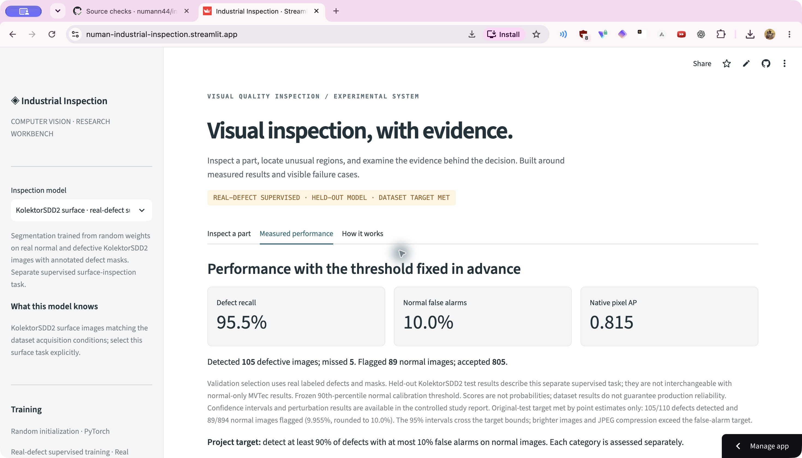

# CPU demo deployment

**Live app:** [numan-industrial-inspection.streamlit.app](https://numan-industrial-inspection.streamlit.app/) · **Published artifacts:** [v0.1.0](https://github.com/numann44/industrial-inspection/releases/tag/v0.1.0)

The hosted Streamlit app serves the four validation-selected v0.1.0 checkpoints: KolektorSDD2 surface, metal nut, screw and transistor. The release is pinned to commit `e76ff78`. Each remotely downloaded weight was checked against the local SHA-256. The datasets and pretrained PatchCore reference are not required to serve the app.

## Verified hosted behavior

All four task selections were exercised on the actual hosted service with their packaged examples. The displayed category, checkpoint identity, frozen threshold and decision were checked. A real Chrome file upload of `assets/examples/kolektor_surface_01_defective.png` returned a defective decision, and all four result exports were downloaded: JSON, overlay PNG, heatmap PNG and raw float32 NPZ.

The uploaded surface example's JSON score agrees exactly with local CPU inference at **0.9999679327011108**. The downloaded float32 map's maximum absolute difference is **1.55e-6**; downloaded rendered images agree exactly. These checks validate the hosted inference/export path on the tested input, not bitwise identity for every possible image or device. [Portable deployment evidence](results/DEPLOYMENT_VERIFICATION.json) records the concrete inputs, model hashes and validation/error-check scope.

Actual hosted screenshot captured October 4, 2026. The page shows 105 detected defects, five misses, 89 normal false alarms and 805 accepted normal images. The rounded 10.0% false-alarm display corresponds to **89/894 = 9.955%**. Dataset target status, confidence-interval limits and brightness/JPEG failures remain visible.

Malformed-file and 11.5 MB oversized-file checks also passed. The app returned `Cannot decode this image; upload a valid PNG, JPEG or WebP` and `Error: File must be 10.0MB or smaller.`, respectively. Packaged examples and the measured-performance panel were restored afterward.

This verification used browser sessions on the development computer against a remote Linux service. It does not establish verification from a second physical client device.

## Release and source checks

The release-tag and main-branch Linux workflows passed:

- [Release-tag workflow, successful attempt 2](https://github.com/numann44/industrial-inspection/actions/runs/37167492944/attempts/2).
- [Main-branch workflow](https://github.com/numann44/industrial-inspection/actions/runs/37167626497).

The first release-tag attempt ran before its model assets were available; the successful retry verifies the published assets. The current local test suite passes **137 tests**, including the separate v3 screen checks. That count is not attributed retroactively to the earlier release-tag workflow.

## Community Cloud configuration

| Field | Value |
| --- | --- |
| Repository | `numann44/industrial-inspection` |
| Branch | `main` |
| Main file path | `app.py` |
| Python | `3.12` |
| Secrets | None |
| Hosting | Free Streamlit Community Cloud, CPU |

The root `requirements.txt` installs CPU PyTorch on Linux. Follow the [official deployment instructions](https://docs.streamlit.io/deploy/streamlit-community-cloud/deploy-your-app/deploy) to reproduce the hosting configuration. `artifacts/models.json` is authoritative for the active model choices and their project-owned GitHub release URLs.

## Artifacts, visualization and privacy

A first request downloads the selected weight, validates its SHA-256 and stores it in `.cache/inspection`; later requests reuse the cached engine. Invalid checksums stop loading. The application does not accept uploaded checkpoint files.

The color range is fixed per checkpoint and can saturate for the surface model's extremely low range. A saturated display color does not mean that all highlighted pixels have equal raw scores. **Exported float32 maps are authoritative for underlying activation values**; display images are previews. The rendering contract remains unchanged while the follow-up training source is frozen. Scores are not defect probabilities, and model activations are not certified defect boundaries.

Users explicitly choose the matching task; the application does not identify arbitrary parts. PNG, JPEG and WebP uploads are limited to 10 MiB and 20 million decoded pixels. Uploaded images are decoded and processed in memory and are never saved by the application. The application does not log image bytes or filenames; hosting-provider access logging is outside its control.

## Historical deployment and continuing quality work

The [v0.1.0-alpha.1 release](https://github.com/numann44/industrial-inspection/releases/tag/v0.1.0-alpha.1) and its exploratory metal-nut pilot remain historical evidence. Its earlier hosted normal-example score difference was `3.64e-12`, and its uploaded failure-example map difference was below `2e-10`. Those numbers belong to the alpha checkpoint, not the new surface model; the original [alpha deployment record](results/DEPLOYMENT_VERIFICATION_ALPHA.json) is retained. Historical screenshots `live-inspection.png` and `live-demo.png` are identified in [their attribution](images/ATTRIBUTION.md).

The completed v0.1.0 publication does not mark all quality goals complete. The surface model passes dataset point estimates only; the three selected MVTec models fail the target. The bounded [v3 synthesis screen](../experiments/study_v3/README.md) runs locally with source/protocol frozen at `b158f56`, a validation-only gate and a maximum of nine new runs including conditional continuation. The six continuation jobs still need an executor and review; the published demo remains on v0.1.0 during screening.
