# Frozen experiment evidence

These metal-nut results are **exploratory development measurements**. The category's test set has been inspected during development; these are not blind final benchmark results. All weights and thresholds were frozen before each reported evaluation.

| Run | Initialization | Input size | Trained / selected epoch | Image AUROC [95% image bootstrap interval] | Native-mask pixel AP |
| --- | --- | --- | --- | --- | --- |
| metal_nut-pilot-001 | random weights | 128 | 30 / 30 | 0.6549 [0.552, 0.753] | 0.213 |
| metal_nut-reconstruction-001 | random weights | 128 | 50 / 45 | 0.6261 [0.481, 0.754] | 0.217 |
| metal_nut-foreground-001 | random weights | 256 | 100 / 100 | 0.7693 [0.674, 0.853] | 0.148 |
| metal_nut-patchcore-002 | ImageNet reference | 256 | normal memory fitting; no gradient training | 0.9995 [0.997, 1.000] | 0.885 |

| Run | Normal calibration quantile | Defects detected / available | Good parts falsely flagged / available | Precision | Recall ≥90% and false alarms ≤10% |
| --- | --- | --- | --- | --- | --- |
| metal_nut-pilot-001 | 0.95 | 37 / 93 | 2 / 22 | 0.949 | failed |
| metal_nut-reconstruction-001 | 0.95 | 10 / 93 | 1 / 22 | 0.909 | failed |
| metal_nut-foreground-001 | 0.95 | 51 / 93 | 1 / 22 | 0.981 | failed |
| metal_nut-patchcore-002 | 0.9 | 93 / 93 | 4 / 22 | 0.959 | failed |

The operating targets are checked at the existing frozen thresholds. No threshold is retuned on test labels. Passing a point-estimate check would still not establish production readiness; these measurements are exploratory and the good-part sample is small.

Defective-image prevalence is 80.9%; image average precision and positive predictive value depend on this unusually defect-heavy test mix. An uninformative image ranking has an AP reference approximately equal to this prevalence. The normal calibration sample size is small, so empirical quantiles do not guarantee future false-alarm rates. Full rate intervals, native-mask area groups, checkpoint checksums and portable prediction records are in [experiment-metrics.json](experiment-metrics.json).

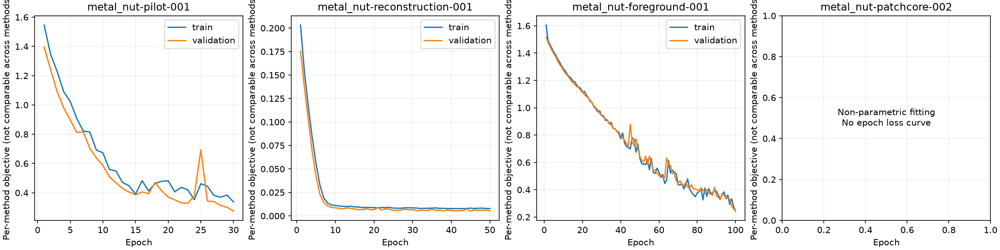

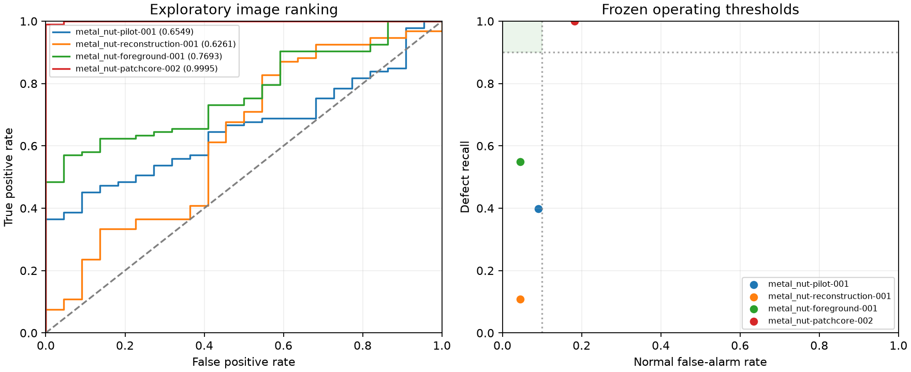

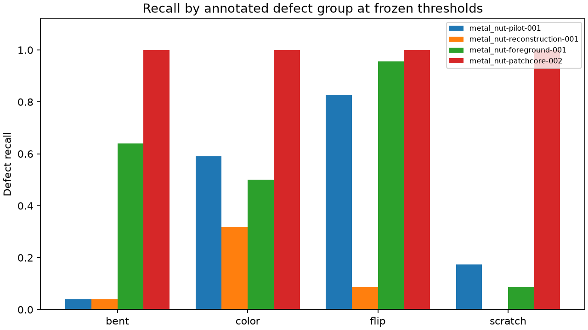

## What the measurements show

The highest image-AUROC point estimate belongs to `metal_nut-patchcore-002` (0.999511); the highest native-mask pixel-AP point estimate belongs to `metal_nut-patchcore-002` (0.885). Image ranking and defect localization are different outcomes. The confidence intervals and fixed-threshold counts should be considered together; these test comparisons do not choose the deployed checkpoint.

The ImageNet reference detects 93 defective parts but falsely flags 4 good parts (18.2%): its false-alarm target is **failed**. It remains a separate reference rather than the released scratch-model demo. See [audited reference provenance](PATCHCORE_REFERENCE.md).

- `metal_nut-pilot-001` misses 56 defective parts and flags 2 good parts. Its lowest-recall annotated group is `bent`: 1/25 detected. The corresponding failure-gallery panels allow direct comparison of predicted activations with annotated defects.
- `metal_nut-reconstruction-001` misses 83 defective parts and flags 1 good parts. Its lowest-recall annotated group is `scratch`: 0/23 detected. The corresponding failure-gallery panels allow direct comparison of predicted activations with annotated defects.
- `metal_nut-foreground-001` misses 42 defective parts and flags 1 good parts. Its lowest-recall annotated group is `scratch`: 2/23 detected. The corresponding failure-gallery panels allow direct comparison of predicted activations with annotated defects.
- `metal_nut-patchcore-002` misses 0 defective parts and flags 4 good parts. Its lowest-recall annotated group is `bent`: 25/25 detected. The corresponding failure-gallery panels allow direct comparison of predicted activations with annotated defects.

High precision alone cannot compensate for missed defective parts. In this defect-heavy test set, inspect recall and false alarms alongside precision. A normal operating threshold remains an empirical calibration rule rather than an accuracy guarantee.

## Interpretation limits

These methods differ in initialization, objective, network capacity, corruption generator, input resolution, learning rate and training budget. They provide descriptive whole-method comparisons and do not isolate the causal effect of any single component. The ImageNet reference uses pretrained WideResNet features and a normal-feature memory bank; it is not a model trained from scratch and its test outcomes do not choose the from-scratch configuration. Its 256-square resize and audited normal split differ from published-paper settings. Lower training/validation loss does not establish better real-defect detection. Pixel AP uses original masks and restored model maps; resizing can remove small input evidence. Image bootstrap intervals do not capture variation across training seeds or deployment domain shift.

## Balanced failure galleries

Gallery selection is deterministic: highest-scoring false positives, lowest-scoring false negatives, and rank-spaced successful cases. Prediction activations and ground truth occupy separate panels. Display ranges are fixed per checkpoint at twice its frozen image threshold; colors are not calibrated probabilities or pixel decisions.

- [metal_nut-pilot-001 gallery index](galleries/metal_nut-pilot-001/index.json)

metal_nut-pilot-001: FP, good, score 0.0648754.

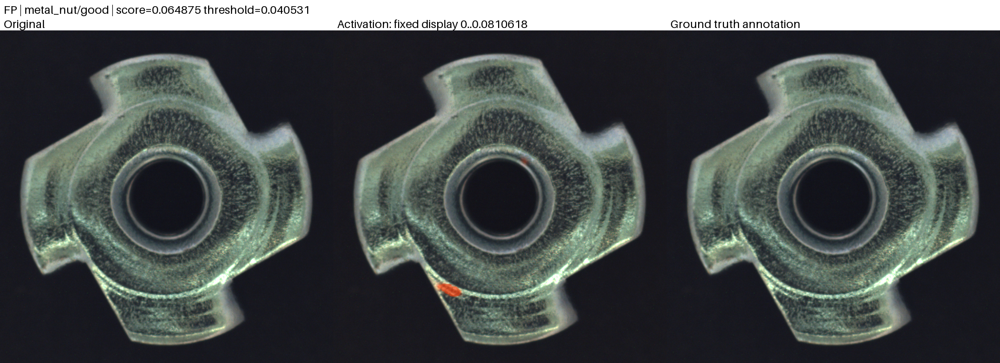

metal_nut-pilot-001: FN, flip, score 0.00144224.

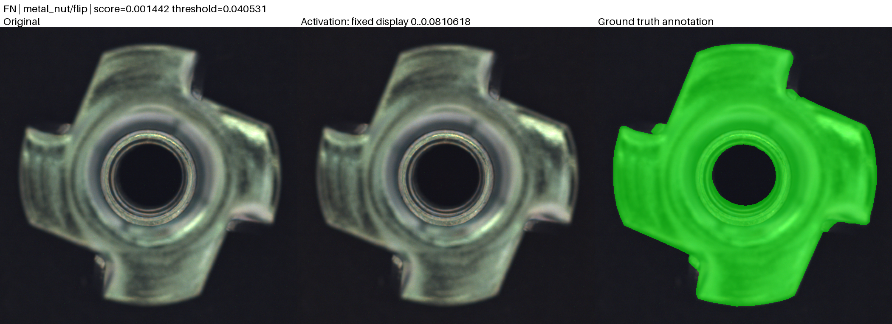

metal_nut-pilot-001: TP, scratch, score 0.0411085.

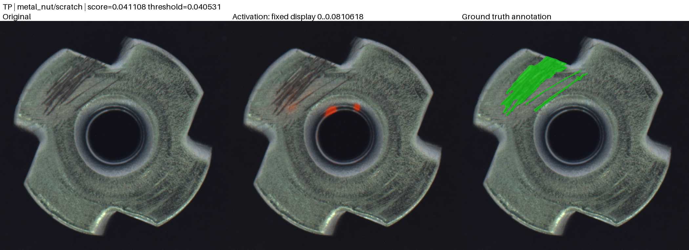

metal_nut-pilot-001: TN, good, score 0.00136155.

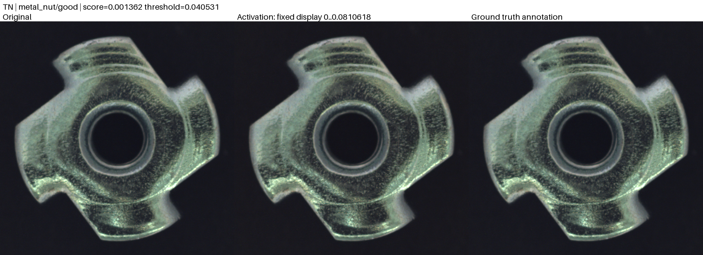
- [metal_nut-reconstruction-001 gallery index](galleries/metal_nut-reconstruction-001/index.json)

metal_nut-reconstruction-001: FP, good, score 0.0413511.

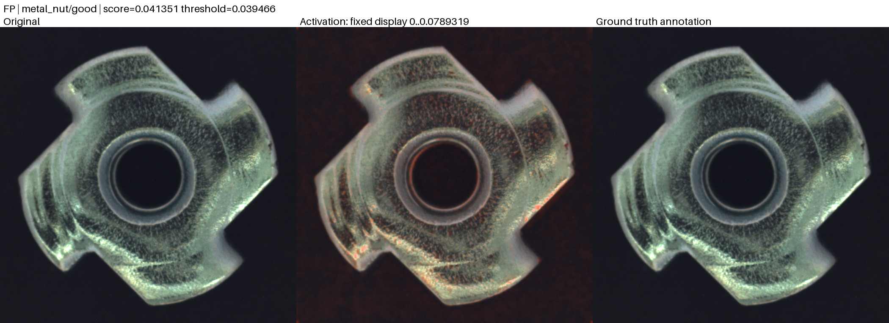

metal_nut-reconstruction-001: FN, scratch, score 0.0253718.

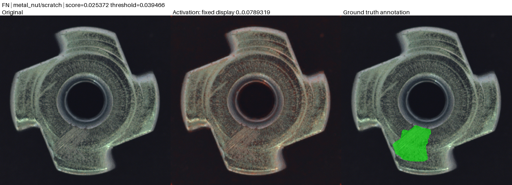

metal_nut-reconstruction-001: TP, bent, score 0.0398381.

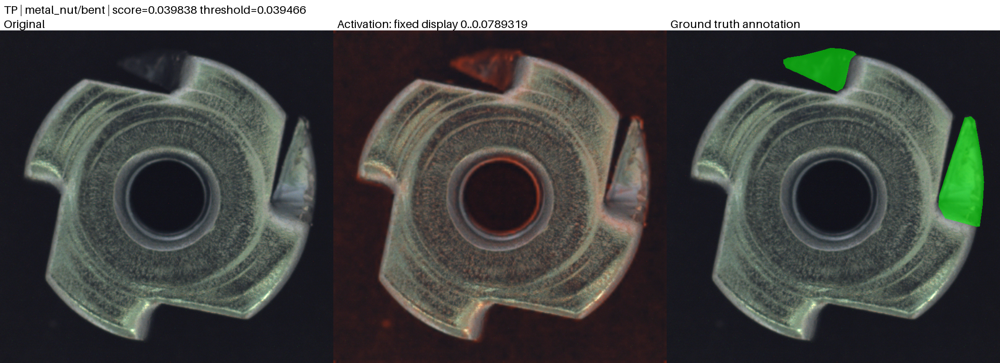

metal_nut-reconstruction-001: TN, good, score 0.0260615.

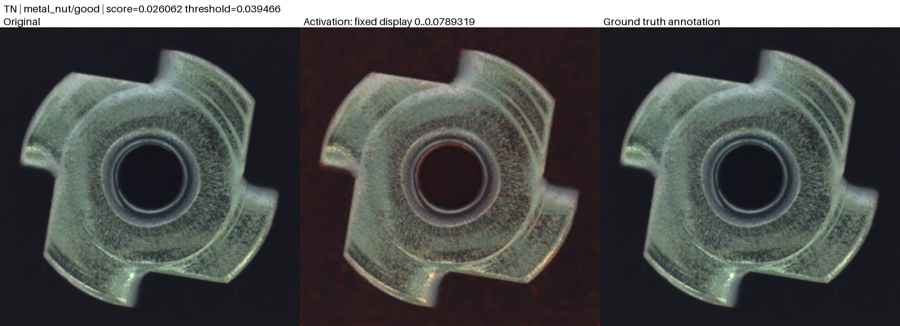
- [metal_nut-foreground-001 gallery index](galleries/metal_nut-foreground-001/index.json)

metal_nut-foreground-001: FP, good, score 6.40301e-05.

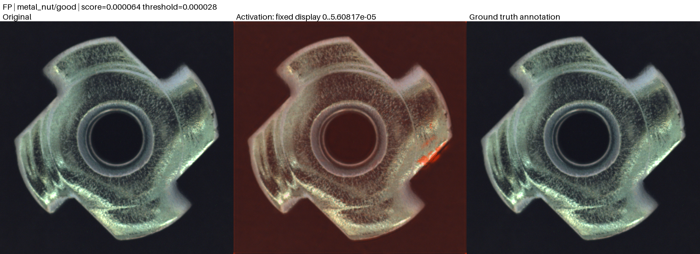

metal_nut-foreground-001: FN, scratch, score 2.30573e-05.

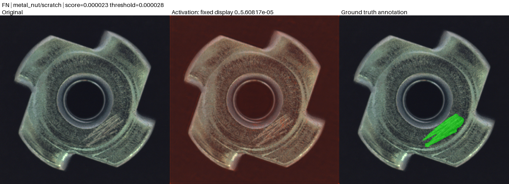

metal_nut-foreground-001: TP, bent, score 2.84105e-05.

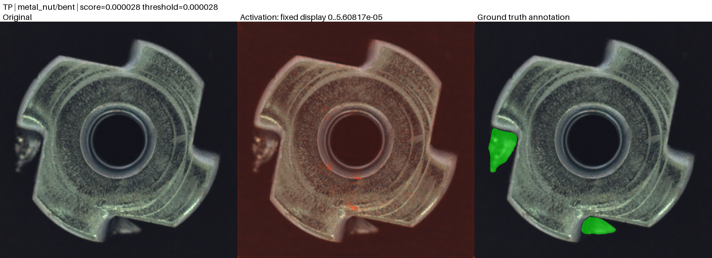

metal_nut-foreground-001: TN, good, score 2.2604e-05.

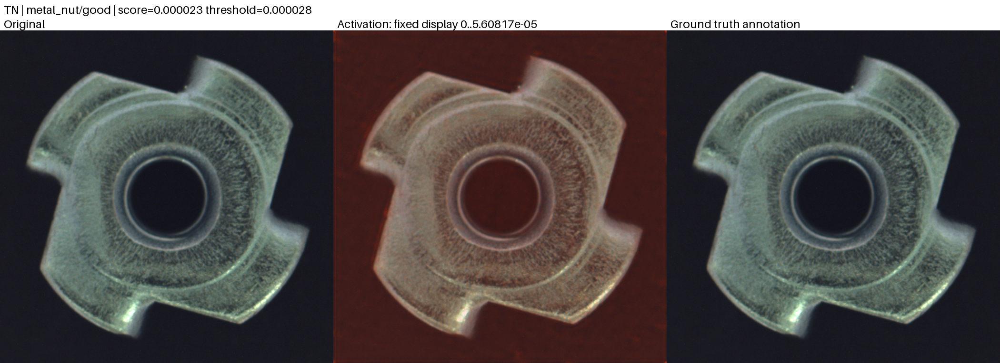
- [metal_nut-patchcore-002 gallery index](galleries/metal_nut-patchcore-002/index.json)

metal_nut-patchcore-002: FP, good, score 3.91223.

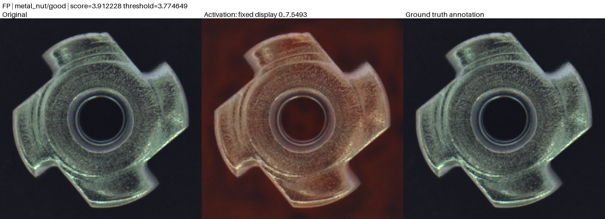

metal_nut-patchcore-002: TP, scratch, score 3.9074.

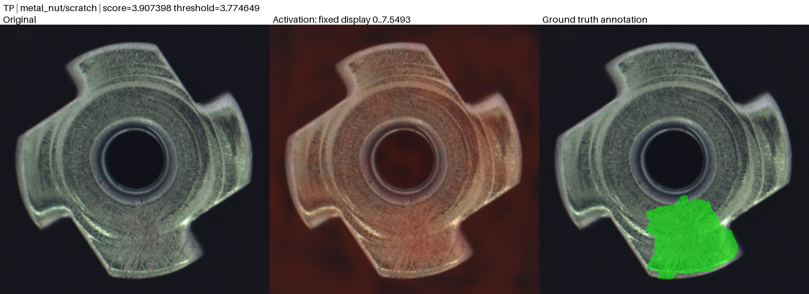

metal_nut-patchcore-002: TN, good, score 3.16387.

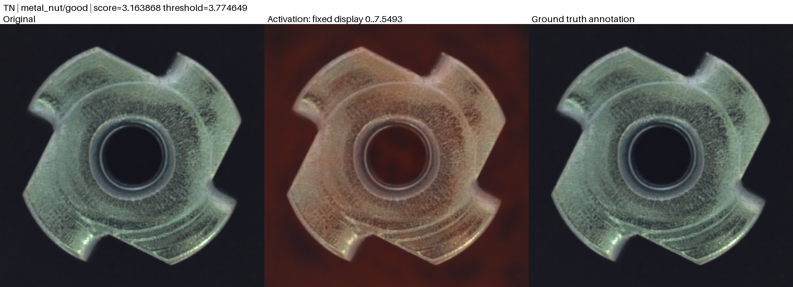

Derivative gallery images retain their dataset's CC BY-NC-SA 4.0 license and individual attribution files. Raw datasets and checkpoints remain outside Git; release assets must carry checksums and model provenance.
