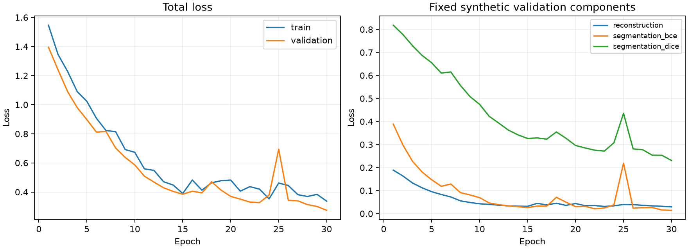
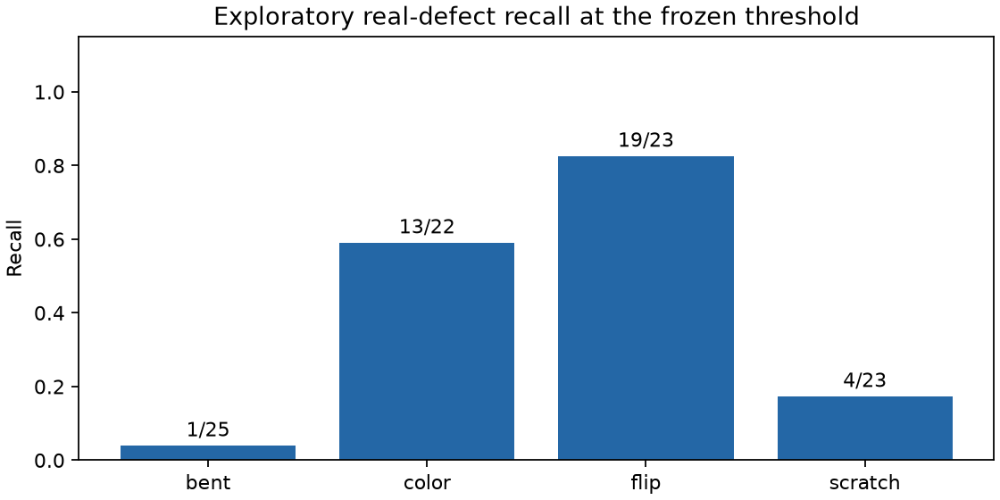

# First training pilot

This is an **exploratory initial run**, not a final benchmark or production model. It verifies the complete data-to-training-to-inspection path and identifies weaknesses for the predeclared experiments.

## Data is available locally

The complete MVTec AD archive matches the published SHA-256. All 15 categories were extracted and audited: **5,354 images** (3,629 original normal training, 467 normal test and 1,258 defective test), plus the associated defect masks. **6,612 PNG files** decoded successfully, including masks. Original counts agree with the official paper. No identical image bytes cross our normal split or test boundaries.

Full portable evidence: [data-verification.json](data-verification.json). Raw data remains local under its CC BY-NC-SA 4.0 license.

## Run

- Category: `metal_nut`; input resolution: 128 × 128.
- Random initialization; compact reconstruction and segmentation networks; no pretrained weights or external texture data.
- Training epochs: 30; best epoch selected by fixed synthetic-validation loss: 30.
- Device: `mps`; PyTorch: `2.14.1`.
- Measured training and calibration duration: 92.6 seconds, excluding download and dataset preparation.
- Validation loss: 1.3956 after epoch 1 → 0.2742 at the selected epoch.
- Code revision: `b91f15f6bfe9c784115f5f53efe673e7efba1427`.
- Portable split digest: `2df9587b2f8d3f7f389a7ef2a1e9e13cf21ea6b6738a1d9023e7daf1d59de5ad`.

## Frozen operating threshold

The threshold was fitted exclusively on 33 held-out normal calibration images using the 95% empirical quantile, `linear` interpolation. Threshold: **0.040531**. Decision rule: score ≥ threshold. Calibration exceedances: 2/33. This small set does not guarantee a 5% future false-alarm rate. Scores and map activations are not calibrated probabilities.

## Exploratory real-defect test

| Measurement | Result |
| --- | ---: |
| Image AUROC | 0.6549 |
| Original-resolution pixel average precision | 0.2130 |
| Defective parts detected | 37 |
| Defective parts missed | 56 |
| Good parts falsely flagged | 2 |
| Good parts accepted | 20 |

| Defect group | Detected / available | Recall |
| --- | ---: | ---: |
| bent | 1 / 25 | 0.040 |
| color | 13 / 22 | 0.591 |
| flip | 19 / 23 | 0.826 |
| scratch | 4 / 23 | 0.174 |

Metrics and timing scope: [pilot-metrics.json](pilot-metrics.json). Pixel metrics preserve original masks and upsample predictions; upsampling cannot restore tiny defects already lost from the resized input.

## Next work

Compare the declared synthesis variants, investigate part/background corruption coverage, add the reconstruction and pretrained-feature baselines, and measure resolution and seed sensitivity. Keep original test observations explicitly exploratory during development. The screw and transistor categories remain available for later experiments and an additional untouched-category generalization check.

Do not treat declining synthetic-validation loss as proof of real-defect performance. The confusion counts and defect-group results above determine which failure cases need attention. The project has not yet established robustness to new cameras, lighting, arbitrary part types or factory operation.
