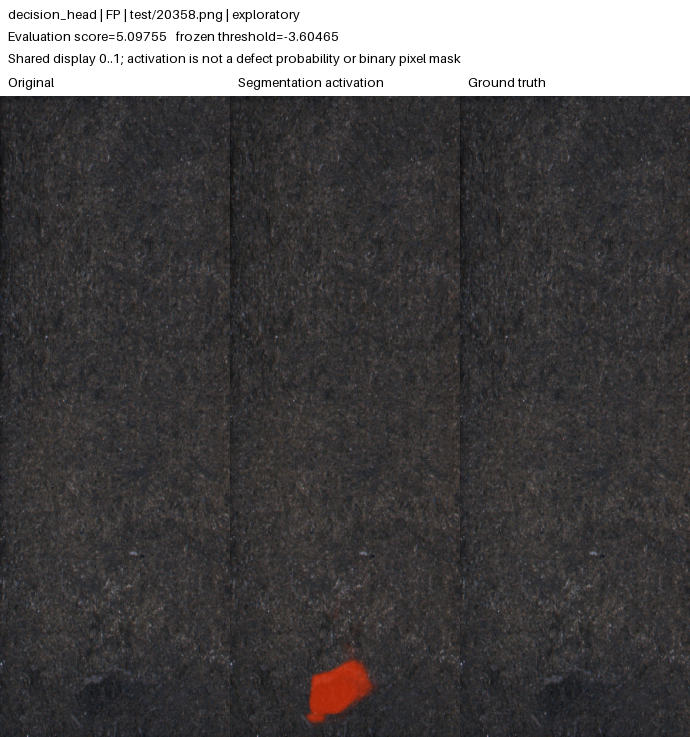
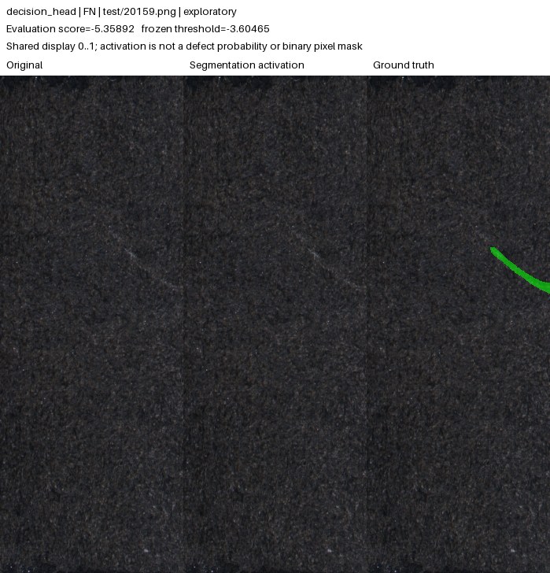

# KolektorSDD2 learned image decision: exploratory results

**The validation-preselected decision head detects 104/110 original-test defects and falsely flags 102/894 normal images. Its original-test point target is NOT MET.**

This completed, exactly two-run comparison uses random initialization and real defect masks in the separate supervised surface task. Every reused-test result is **development-inspected / exploratory**. Neither training completion nor a passing validation gate establishes independent reliability. This report performs no model promotion; the published v0.1.0 registry, live demo and historical evidence remain unchanged.

[Portable evidence with full-precision predictions and hashes](KSDD2_DECISION_RESULTS.json) · [Declared method](../KSDD2_DECISION_SCREEN.md) · [Frozen implementation](../../experiments/ksdd2_decision/README.md) · [Previous acquisition experiment](KSDD2_ROBUSTNESS_RESULTS.md) · [Historical v0.1.0](CONTROLLED_STUDY.md)

## What the comparison changes

Both fresh seed-42 runs use the same base-16 U-Net, audited partitions, balanced batch of eight, Adam at 0.0003, positive-weight-3 BCE plus Dice, and 640-high × 256-wide letterboxing. Both retain the acquisition policy: 50% unchanged images; otherwise native-image brightness U(0.75, 1.25), then JPEG integer quality 60–95. Padding is excluded from the relevant losses and score statistics.

Control averages the strongest 1% of valid sigmoid segmentation responses. The candidate learns an image classifier from detached bottleneck features, detached segmentation logits and valid map statistics, with image-label BCE. It adds 25,747 parameters to the 488,705-parameter backbone (514,452 total). Its raw image logit can be negative; greater means more defective, not a calibrated defect probability. This compact implementation adapts the ViCoS mixed segmentation/decision idea and is not a reproduction of the published architecture or results.

**Classification gradients cannot update the segmentation network.** Control selected epoch 5 and stopped at 20; the head selected epoch 25 and stopped at 40. Both had the same 100-epoch cap and 15 stale-training-epoch stopping rule, but realized compute and selected checkpoints differ. Any localization difference includes checkpoint-selection effects; it is not evidence that a detached head directly improved segmentation gradients or a controlled same-epoch head-only effect.

The returned spatial map remains the segmentation model's pixel response. It is not a causal explanation of the separate image-classification decision.

## Validation selection and frozen gate

Checkpoint selection uses pooled standardized partial image AUROC over false-positive rates 0–0.1, with the earliest checkpoint retained on an exact tie. The same frozen bank contains four variants of each of 350 sources, not 1,400 independent images. Model-space validation pixel AP excludes padding.

| Run | Completed epochs | Selected epoch | Pooled partial AUROC | Pooled full AUROC | Pooled pixel AP |
| --- | ---: | ---: | ---: | ---: | ---: |
| control | 20 | 5 | 0.855588 | 0.943507 | 0.601553 |
| decision_head | 40 | 25 | 0.948094 | 0.951515 | 0.736248 |

The predeclared gate passed: partial-AUROC gain **0.092506328**, a **64.057% reduction in the control's 1−R shortfall** (required ≥10%, with strictly positive gain). Pooled pixel AP changed by **+0.134695129**. Every per-condition partial-AUROC and pixel-AP regression was within the allowed 0.01. No condition-specific winning epochs were mixed together.

| Validation condition | Control partial AUROC | Head partial AUROC | Partial-AUROC change | Pixel-AP change |
| --- | ---: | ---: | ---: | ---: |
| clean | 0.864070 | 0.951418 | +0.087348 | +0.122678 |
| brightness_0.8 | 0.847118 | 0.949145 | +0.102027 | +0.156407 |
| brightness_1.2 | 0.865887 | 0.948236 | +0.082349 | +0.100490 |
| jpeg_quality_60 | 0.843619 | 0.945510 | +0.101891 | +0.158417 |

The paired grouped-bootstrap validation partial-AUROC difference is **+0.092506**, with 95% interval **[+0.036300, +0.150059]**. It excludes zero. This is descriptive uncertainty on reused validation sources, not new independent significance evidence, an interval for pixel AP or a guarantee at the calibrated operating threshold. The 1,000 bootstrap samples retain all four variants of each sampled source; the interval did not determine the gate.

## Original-test decisions and localization

Both selected checkpoint hashes and the passing gate were fixed before either calibration. Each model then received one linear q90 threshold from the same 313 separate clean normal calibration scores. No test or perturbation result changed either threshold; positive calibration images remained unused.

| Run | TP / defects | FN | FP / normals | TN | Recall [95% Wilson] | Normal false alarms [95% Wilson] | Point target |
| --- | --- | ---: | --- | ---: | --- | --- | --- |
| control | 97/110 | 13 | 81/894 | 813 | 88.182% [80.825, 92.962]% | 9.060% [7.350, 11.121]% | NOT MET |
| decision_head | 104/110 | 6 | 102/894 | 792 | 94.545% [88.608, 97.476]% | 11.409% [9.488, 13.661]% | NOT MET |

| Run | Image AUROC [95% image bootstrap] | Image AP | Native pixel AP | Alert precision [95% Wilson] | Frozen threshold |
| --- | --- | ---: | ---: | --- | ---: |
| control | 0.957637 [0.936, 0.975] | 0.861786 | 0.649225 | 54.494% [47.161, 61.638]% | 0.431956839561 |
| decision_head | 0.978137 [0.962, 0.992] | 0.938424 | 0.834704 | 50.485% [43.712, 57.241]% | -3.60464634895 |

The target requires both recall ≥90% and normal false alarms ≤10% on the measured dataset. Passing point estimates do not establish population bounds. Rate intervals use Wilson scores and AUROC intervals use 1,000 stratified image-bootstrap samples; they do not correct prior test inspection, domain shift, unknown physical-product groups or training-seed variability. Alert precision depends on the dataset's prevalence.
Native pixel AP restores maps to the original image dimensions and uses unchanged native masks. It differs from model-space validation AP and has no estimated confidence interval. Resizing can discard details that interpolation cannot restore. Raw negative classification logits are valid and are never clamped to the 0–1 segmentation-map range.

## Native defect-size groups

| Run / annotated area | Detected / defective | Missed | Recall [95% Wilson] |
| --- | --- | ---: | --- |
| control / tiny_below_0.1_percent | 0/1 | 1 | 0.000% [0.000, 79.345]% |
| control / small_0.1_to_1_percent | 28/37 | 9 | 75.676% [59.883, 86.639]% |
| control / medium_1_to_5_percent | 50/53 | 3 | 94.340% [84.630, 98.056]% |
| control / large_at_least_5_percent | 19/19 | 0 | 100.000% [83.182, 100.000]% |
| decision_head / tiny_below_0.1_percent | 0/1 | 1 | 0.000% [0.000, 79.345]% |
| decision_head / small_0.1_to_1_percent | 34/37 | 3 | 91.892% [78.699, 97.204]% |
| decision_head / medium_1_to_5_percent | 51/53 | 2 | 96.226% [87.246, 98.959]% |
| decision_head / large_at_least_5_percent | 19/19 | 0 | 100.000% [83.182, 100.000]% |

The bins use original-mask area divided by original-image area. Small groups have wide uncertainty, and an empty group has no recall estimate. Every evaluated image, including each failure, remains in the portable predictions.

## Paired stress tests with fixed thresholds

| Run / condition | Detected / defects | False alarms / normals | Recall [95% Wilson] | False alarms [95% Wilson] | Image AP | Decisions changed | Point target |
| --- | --- | --- | --- | --- | ---: | ---: | --- |
| control / original | 97/110 | 81/894 | 88.182% [80.825, 92.962]% | 9.060% [7.350, 11.121]% | 0.861786 | 0 | NOT MET |
| control / gaussian_blur_radius_1 | 97/110 | 70/894 | 88.182% [80.825, 92.962]% | 7.830% [6.244, 9.777]% | 0.853950 | 21 | NOT MET |
| control / brightness_0.8 | 99/110 | 119/894 | 90.000% [82.976, 94.324]% | 13.311% [11.240, 15.695]% | 0.850499 | 50 | NOT MET |
| control / brightness_1.2 | 96/110 | 75/894 | 87.273% [79.765, 92.265]% | 8.389% [6.745, 10.389]% | 0.860062 | 25 | NOT MET |
| control / jpeg_quality_60 | 97/110 | 105/894 | 88.182% [80.825, 92.962]% | 11.745% [9.796, 14.021]% | 0.844658 | 46 | NOT MET |
| decision_head / original | 104/110 | 102/894 | 94.545% [88.608, 97.476]% | 11.409% [9.488, 13.661]% | 0.938424 | 0 | NOT MET |
| decision_head / gaussian_blur_radius_1 | 102/110 | 67/894 | 92.727% [86.302, 96.269]% | 7.494% [5.944, 9.408]% | 0.928153 | 45 | MET (point estimates) |
| decision_head / brightness_0.8 | 102/110 | 79/894 | 92.727% [86.302, 96.269]% | 8.837% [7.148, 10.878]% | 0.927204 | 33 | MET (point estimates) |
| decision_head / brightness_1.2 | 105/110 | 116/894 | 95.455% [89.798, 98.043]% | 12.975% [10.930, 15.338]% | 0.939731 | 37 | NOT MET |
| decision_head / jpeg_quality_60 | 101/110 | 94/894 | 91.818% [85.178, 95.636]% | 10.515% [8.670, 12.697]% | 0.924997 | 57 | NOT MET |

Point targets remain unmet for: `control/original`, `control/gaussian_blur_radius_1`, `control/brightness_0.8`, `control/brightness_1.2`, `control/jpeg_quality_60`, `decision_head/original`, `decision_head/brightness_1.2`, `decision_head/jpeg_quality_60`.
These five conditions reuse the same source images and are paired observations. The original condition's decisions match native evaluation. Stress analysis measures image decisions and rankings only; no stress pixel AP is claimed. The named blur, brightness and JPEG transformations do not establish reliability under arbitrary camera/product/acquisition changes.

## Auditable examples and errors

The galleries contain **24 real evaluated examples**, taking up to three available images from each false-positive, false-negative, true-positive and true-negative group per model. Highest-scoring false alarms and lowest-scoring misses expose the strongest errors; correct decisions use evenly spaced score ranks. The selection is illustrative, not an unbiased sample or a substitute for the complete confusion counts.

- [control gallery index](ksdd2-decision-galleries/control/index.json) · [Attribution](ksdd2-decision-galleries/control/ATTRIBUTION.md)
- [decision_head gallery index](ksdd2-decision-galleries/decision_head/index.json) · [Attribution](ksdd2-decision-galleries/decision_head/ATTRIBUTION.md)

All maps share the fixed 0–1 segmentation-activation scale. Captions retain frozen batched image scores and decisions; maps use the same weights in single-image inference. A head image logit is a separate quantity and is not on that color scale. Very small activations can appear dark, and the displayed segmentation map is not a causal attribution of the learned classifier.

False alarm from the decision-head model:

Missed defect from the decision-head model:

## Local CPU and MPS timings

| Run | Device | Warm median (ms) | Warm p95 (ms) | Measurements / warmups |
| --- | --- | ---: | ---: | --- |
| control | cpu | 100.549 | 105.294 | 32 / 3 |
| control | mps | 15.209 | 16.009 | 32 / 3 |
| decision_head | cpu | 133.286 | 155.356 | 32 / 3 |
| decision_head | mps | 16.104 | 16.567 | 32 / 3 |

Measurements ran sequentially under the shared scheduler lock with the same checksum-pinned clean normal calibration image. Warm model-forward/scoring time includes the learned head when present; loading, decoding, preprocessing, transfers, rendering and hosting overhead are excluded. The lock does not guarantee external system idleness. These local device timings are not hosted response-time guarantees.

## Provenance and interpretation limits

| Identity | Digest |
| --- | --- |
| Training declaration | `1313dc36f755ad42b3ef63a9867011af476eaf3010cbae1593b7af0d70308e28` |
| Evaluation freeze | `b0fbfbd56be39b11eebda3f072468b105a2c6bd8f1cdcdbb177a8c2ef9b73464` |
| Audited split | `30d06172a747eeaae3d12d3dd4e0b42a1f7dcb7f90759a5ecd4d6610df9a3b75` |
| control calibrated checkpoint | `0de4fc4f957f66a884151736c0802624d7c337e4ed12dc604838ee1ab1becf26` |
| decision_head calibrated checkpoint | `64f96111fa96809cc525aa57d3eab8c817f41c28f703da1e91e9550bd3621e20` |

The portable JSON preserves full predictions, original artifact hashes, source and score identities, calibration scores, selected-epoch histories, grouped validation evidence and uncertainty. Absolute user paths are replaced with portable identifiers. Original hashes refer to unmodified local records, not normalized copies; the portable evidence has its own digest. This renderer opens no dataset image or mask, performs no inference and changes no threshold.
There is one training seed per condition and different validation-selected epochs. The head adds parameters and supervised image computation; it does not turn this into a supervision-matched comparison with normal-only MVTec. Prior test inspection makes every new same-dataset outcome exploratory. A genuinely untouched same-category holdout with documented acquisition/product groups is needed for new independent reliability claims. Historical v0.1.0 evidence and deployed weights remain separate; this report does not promote either new model.
