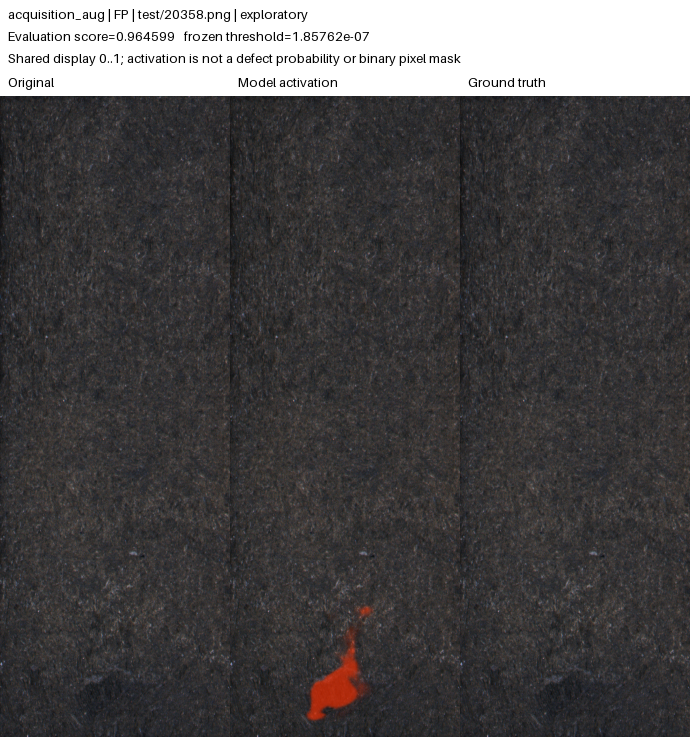
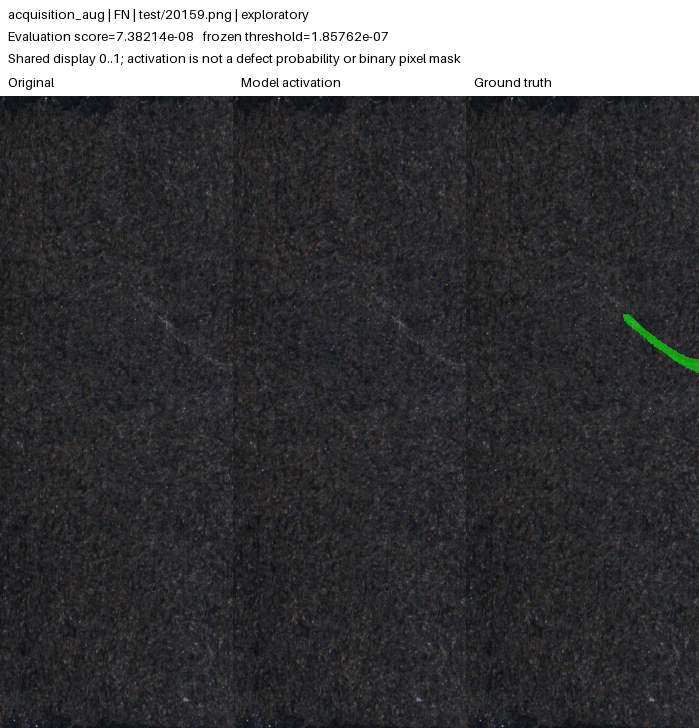

# KolektorSDD2 acquisition robustness: exploratory results

**The preselected augmented model detects 106/110 original-test defects and falsely flags 115/894 normal images. Its original-test point target is NOT MET.**
This is a completed comparison of two fresh models trained with real defect masks. The candidate was selected by validation before these reused-test results were observed. Every result below is **development-inspected / exploratory**, with no new independent-success claim and no automatic model promotion. The separate published v0.1.0 model and historical evidence remain unchanged.

[Portable evidence with full precision, predictions and hashes](KSDD2_ROBUSTNESS_RESULTS.json) · [Frozen protocol](../../experiments/ksdd2_robustness/README.md) · [Historical v0.1.0 study](CONTROLLED_STUDY.md)

## Matched training and prior validation gate

Control and candidate share seed 42, the original audited splits, base-16 U-Net, balanced batches of eight, Adam at 0.0003, positive-weighted BCE plus Dice, and 640-high × 256-wide letterboxing. The candidate keeps an image unchanged with probability 0.5; otherwise it applies brightness U(0.75, 1.25) followed by JPEG integer quality 60–95 before letterboxing. This tests the combined augmentation policy, not either ingredient in isolation.

Both have a 100-epoch maximum, validation every five epochs and 15 stale training epochs of patience. Their actual stopping epochs can differ. A single pooled-selected checkpoint supplies each run's per-condition metrics; no condition-specific winning epochs are mixed together.

| Run | Completed epochs | Selected epoch | Pooled validation AUROC | Pooled model-space pixel AP | Pooled H |
| --- | ---: | ---: | ---: | ---: | ---: |
| control | 45 | 30 | 0.963620 | 0.718344 | 0.823098 |
| acquisition_aug | 50 | 35 | 0.970566 | 0.754238 | 0.848836 |

The frozen gate passed with pooled H gain **0.025737772** (required ≥0.01), while every condition H regression remained within 0.01. Clean and degraded validation conditions used the same 350 source images, with four paired variants each.

| Validation condition | Control H | Augmented H | Change |
| --- | ---: | ---: | ---: |
| clean | 0.841218 | 0.856760 | +0.015541 |
| brightness_0.8 | 0.811907 | 0.851556 | +0.039650 |
| brightness_1.2 | 0.816670 | 0.855278 | +0.038608 |
| jpeg_quality_60 | 0.823965 | 0.831679 | +0.007715 |

The paired grouped-bootstrap validation image-AUROC difference is **+0.006946**, with 95% interval **[-0.000708, +0.016731]**. It crosses zero. This is descriptive uncertainty on reused validation sources, not an independent significance claim; it is not an interval for H or pixel AP and did not change the gate.
JPEG validation image AUROC and pixel AP are retained separately in the JSON; an increase in their harmonic mean does not imply every component metric improved.

## Original-test decisions and localization

Thresholds were fit once, only after both checkpoints and the passing validation gate were frozen. Each uses the 90th percentile of the same 313 separate clean normal calibration scores. No test or stress result changed a threshold.

| Run | TP / defects | FN | FP / normals | TN | Recall [95% Wilson] | Normal false alarms [95% Wilson] | Target |
| --- | --- | ---: | --- | ---: | --- | --- | --- |
| control | 104/110 | 6 | 98/894 | 796 | 94.545% [88.608, 97.476]% | 10.962% [9.079, 13.179]% | NOT MET |
| acquisition_aug | 106/110 | 4 | 115/894 | 779 | 96.364% [91.021, 98.577]% | 12.864% [10.827, 15.218]% | NOT MET |

| Run | Image AUROC [95% image bootstrap] | Image AP | Native pixel AP | Alert precision [95% Wilson] | Frozen threshold |
| --- | --- | ---: | ---: | --- | ---: |
| control | 0.981859 [0.968, 0.992] | 0.931086 | 0.800701 | 51.485% [44.630, 58.285]% | 4.15221046524e-07 |
| acquisition_aug | 0.985133 [0.972, 0.995] | 0.949484 | 0.811400 | 47.964% [41.468, 54.529]% | 1.85762218052e-07 |

The joint target is recall ≥90% and normal false alarms ≤10% on the measured dataset. A passing point estimate does not establish either population-level bound; confidence intervals may cross those bounds. Image AUROC intervals use 1,000 stratified bootstrap samples; rate intervals use Wilson scores. They do not capture domain shift, training-seed variability or independent production batches. Alert precision reflects this dataset's defect prevalence.
Final pixel AP uses predictions restored to original image dimensions and unchanged native masks. It is distinct from model-space validation AP. No confidence interval for pixel AP is supplied, and interpolation cannot recover details lost in resizing.

## Native defect-size groups

| Run / native annotation area | Detected / defective | Missed | Recall [95% Wilson] |
| --- | --- | ---: | --- |
| control / tiny_below_0.1_percent | 0/1 | 1 | 0.000% [0.000, 79.345]% |
| control / small_0.1_to_1_percent | 33/37 | 4 | 89.189% [75.291, 95.715]% |
| control / medium_1_to_5_percent | 52/53 | 1 | 98.113% [90.057, 99.666]% |
| control / large_at_least_5_percent | 19/19 | 0 | 100.000% [83.182, 100.000]% |
| acquisition_aug / tiny_below_0.1_percent | 0/1 | 1 | 0.000% [0.000, 79.345]% |
| acquisition_aug / small_0.1_to_1_percent | 34/37 | 3 | 91.892% [78.699, 97.204]% |
| acquisition_aug / medium_1_to_5_percent | 53/53 | 0 | 100.000% [93.242, 100.000]% |
| acquisition_aug / large_at_least_5_percent | 19/19 | 0 | 100.000% [83.182, 100.000]% |

Area bins are based on the original annotation's fraction of image pixels. Empty groups have no recall estimate; small groups carry wide uncertainty. Full predictions preserve both mistakes and correct decisions. No failure image was discarded by this report.

## Auditable examples and errors

The two galleries contain 24 real dataset examples in total: three false positives, false negatives, true positives and true negatives per model. False positives use the highest scores, false negatives the lowest, and correct decisions evenly spaced score ranks. This stated selection is illustrative, not a representative sample or a substitute for all 1,004 predictions.

- [Control gallery index](ksdd2-robustness-galleries/control/index.json) · [Control attribution](ksdd2-robustness-galleries/control/ATTRIBUTION.md)
- [Augmented gallery index](ksdd2-robustness-galleries/acquisition_aug/index.json) · [Augmented attribution](ksdd2-robustness-galleries/acquisition_aug/ATTRIBUTION.md)

All maps share the fixed 0–1 color range. The single-image maps use the same frozen weights; captions and decisions retain the saved batched evaluation scores. Very small nonzero responses can be visually dark on this range even when they exceed the much smaller operating threshold. A dark map is not a numerical zero or a calibrated defect probability.

Augmented model: an annotated-normal image incorrectly flagged as defective:

Augmented model: a real defect missed at the unchanged threshold:

## Paired stress conditions at unchanged thresholds

| Run / condition | Detected / defects | False alarms / normals | Recall [95% Wilson] | False alarms [95% Wilson] | Decisions changed | Target |
| --- | --- | --- | --- | --- | ---: | --- |
| control / original | 104/110 | 98/894 | 94.545% [88.608, 97.476]% | 10.962% [9.079, 13.179]% | 0 | NOT MET |
| control / gaussian_blur_radius_1 | 101/110 | 78/894 | 91.818% [85.178, 95.636]% | 8.725% [7.047, 10.756]% | 47 | MET (point estimates) |
| control / brightness_0.8 | 98/110 | 105/894 | 89.091% [81.895, 93.649]% | 11.745% [9.796, 14.021]% | 71 | NOT MET |
| control / brightness_1.2 | 107/110 | 207/894 | 97.273% [92.287, 99.068]% | 23.154% [20.508, 26.031]% | 124 | NOT MET |
| control / jpeg_quality_60 | 103/110 | 153/894 | 93.636% [87.444, 96.884]% | 17.114% [14.787, 19.722]% | 110 | NOT MET |
| acquisition_aug / original | 106/110 | 115/894 | 96.364% [91.021, 98.577]% | 12.864% [10.827, 15.218]% | 0 | NOT MET |
| acquisition_aug / gaussian_blur_radius_1 | 105/110 | 86/894 | 95.455% [89.798, 98.043]% | 9.620% [7.856, 11.729]% | 44 | MET (point estimates) |
| acquisition_aug / brightness_0.8 | 106/110 | 129/894 | 96.364% [91.021, 98.577]% | 14.430% [12.278, 16.885]% | 54 | NOT MET |
| acquisition_aug / brightness_1.2 | 106/110 | 131/894 | 96.364% [91.021, 98.577]% | 14.653% [12.486, 17.123]% | 46 | NOT MET |
| acquisition_aug / jpeg_quality_60 | 106/110 | 185/894 | 96.364% [91.021, 98.577]% | 20.694% [18.166, 23.472]% | 138 | NOT MET |

Point targets remain unmet for: `control/original`, `control/brightness_0.8`, `control/brightness_1.2`, `control/jpeg_quality_60`, `acquisition_aug/original`, `acquisition_aug/brightness_0.8`, `acquisition_aug/brightness_1.2`, `acquisition_aug/jpeg_quality_60`.
The five conditions reuse the same test images, without retraining or recalibration. Their observations are paired, not independent datasets. Stress results measure image decisions only; stress pixel AP was not computed. These specified blur/brightness/JPEG transformations do not establish robustness to arbitrary cameras, lighting, products or new defect families.

## Local CPU and MPS timings

| Run | Device | Warm median (ms) | Warm p95 (ms) | Measurements / warmups |
| --- | --- | ---: | ---: | --- |
| control | cpu | 99.646 | 102.364 | 32 / 3 |
| control | mps | 12.419 | 13.387 | 32 / 3 |
| acquisition_aug | cpu | 99.497 | 107.102 | 32 / 3 |
| acquisition_aug | mps | 12.391 | 13.523 | 32 / 3 |

Benchmarks ran sequentially under the project scheduler lock, using the same checksum-pinned first clean normal calibration image. They measure warm forward/scoring time, excluding loading, decoding, preprocessing, transfers, rendering and hosting overhead. The lock serializes this project's jobs; it cannot enforce external system idleness. These are local measurements, not hosted response-time guarantees.

## Provenance and limits

| Identity | Digest |
| --- | --- |
| Training declaration | `b44f6cc28815a9db5bee0dbc8bb653805d4304c10db1c7a332a9bccbd9e9643a` |
| Evaluation freeze | `951bd25a329a7ebb3b244eaf64c2ae94ad5aa899cc79ec48ad2f84fc893bbab6` |
| Audited split | `30d06172a747eeaae3d12d3dd4e0b42a1f7dcb7f90759a5ecd4d6610df9a3b75` |
| control calibrated checkpoint | `74637c07e33f1426be71fcdba42368c9ccab10f56b332930df9abbaefd397681` |
| acquisition_aug calibrated checkpoint | `5fd9d3c7134a334f153c546aefc353f924100268e270db8948848571cde057c3` |

The portable JSON preserves all model, calibration, source and evaluator identities, original local artifact hashes, full predictions and uncertainty. Machine-specific path prefixes are removed; original hashes identify original artifacts, not the normalized copies. The report reads saved artifacts only and never reruns models, opens dataset images, changes thresholds or promotes a checkpoint.
Both models use random initialization and real-defect supervision in the separate KolektorSDD2 scenario. They do not establish success for the normal-only MVTec parts. Both runs use seed 42, so training-seed variability is unmeasured. The original KSDD2 test/stress results informed this new method, making all reused results exploratory. A genuinely untouched same-category holdout and independent acquisition/product groups are still needed for new independent reliability claims.
